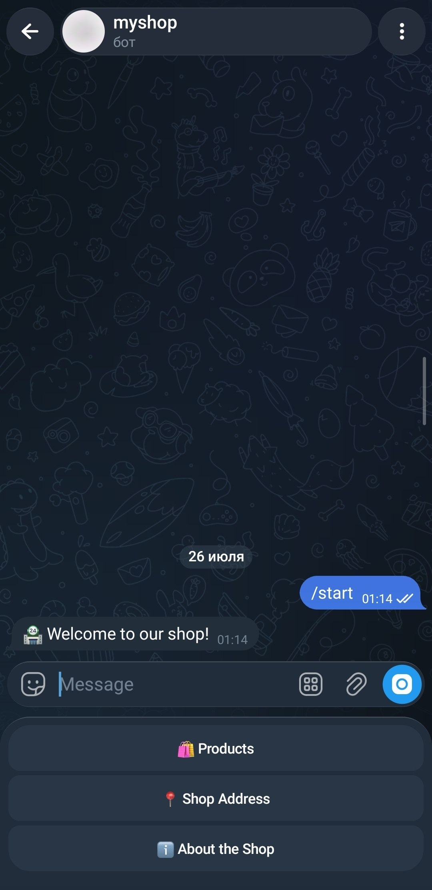
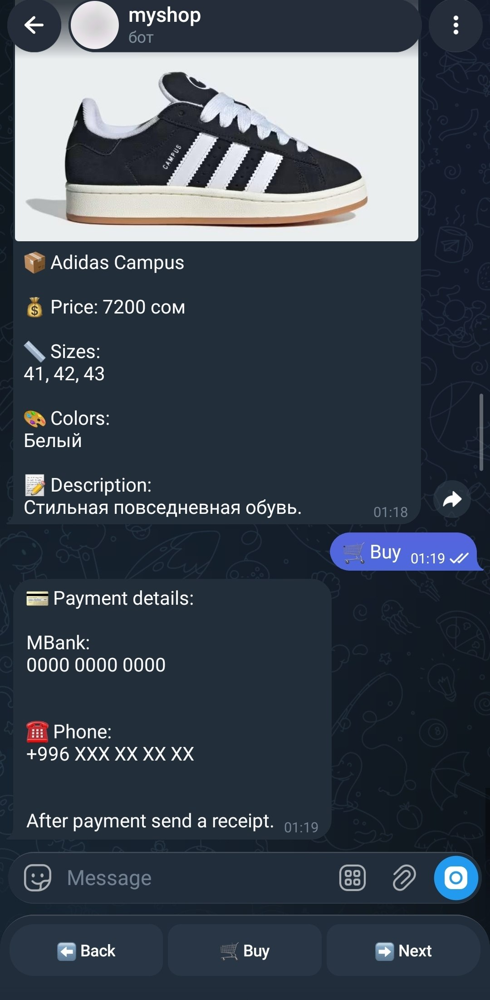
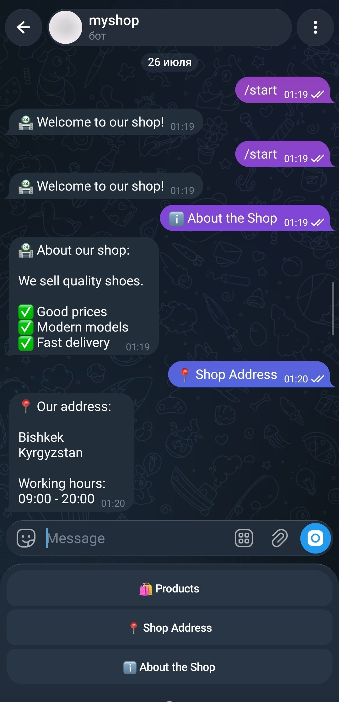

# 🛒 Telegram Store Bot

A Telegram store bot built with Python that allows users to browse products, add items to a cart, and interact with an online shop directly through Telegram.

## 📌 Description

Telegram Store Bot is a simple e-commerce application that provides customers with an easy way to view products and interact with a store using Telegram.

The project demonstrates Telegram bot development, user interaction handling, and basic product management.

## ✨ Features

- 🛍 View available products
- 📦 Product information and prices
- 🛒 Add products to cart
- 💬 User interaction through Telegram commands
- ⚙️ Product management system
- 💾 Data storage support

## 📸 Screenshots

### Start Menu



### Products


### Purchase Process



### Other Features



## 🛠 Technologies

- Python 3
- Telegram Bot API
- Aiogram
- SQLite
- python-dotenv

## 📂 Project Structure

```
MyShop_Telegramm-Bot/
│
├── main.py              # Bot entry point
├── config.py            # Configuration and environment variables
├── handlers.py          # Bot handlers
├── keyboards.py         # Telegram keyboards
├── requirements.txt     # Dependencies
├── screenshots/         # Project screenshots
└── README.md
```

## ⚙️ Installation

### 1. Clone the repository

```bash
git clone https://github.com/syimyq1/MyShop_Telegramm-Bot.git
```

### 2. Go to the project folder

```bash
cd MyShop_Telegramm-Bot
```

### 3. Create virtual environment

```bash
python3 -m venv .venv
```

Activate it:

**Mac/Linux:**

```bash
source .venv/bin/activate
```

### 4. Install dependencies

```bash
pip install -r requirements.txt
```

### 5. Configure environment variables

Create a `.env` file:

```env
TOKEN=your_telegram_bot_token
```

### 6. Run the bot

```bash
python main.py
```

## 🚀 Future Improvements

- 👤 User accounts
- 💳 Payment integration
- 📊 Admin dashboard
- 🔍 Product search
- ⭐ Reviews and ratings
- 🗄 Improved database system

## 👨‍💻 Author

Syimyk

GitHub:
https://github.com/syimyq1
